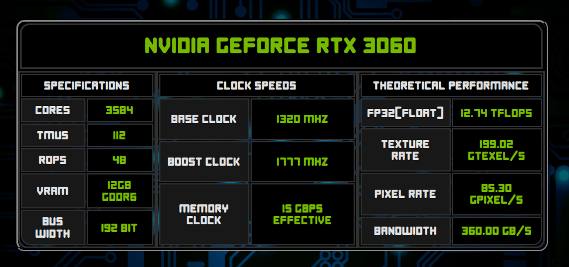
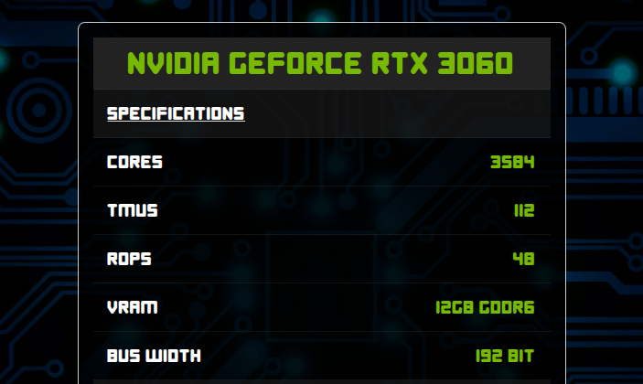

# MongoDB GPUs

## Table of Contents
- [About](#about)
- [Docker](#docker)
- [Accessing the web app](#accessing-the-web-app)
- [CRUD operations](#crud-operations)


## About
A Node.js + Express + Apollo GraphQL backend that serves a built React frontend and connects to MongoDB Atlas using environment variables. The Docker image was pushed to a public Docker Hub repository and deployed as a single Web Service on Render. The Render deployment is triggered automatically on GitHub push.

**Render Web Service link:** https://mongodb-gpus.onrender.com


## Docker
### Docker Compose
Development build
```
docker compose -f ./docker-compose.dev.yml up -d
```

- The development build uses a containerized Mongo database for testing, preventing it from affecting the main MongoDB database from the cloud server.

Production build
```
docker-compose up -d
```

### Using separate Docker containers
1. Create a custom network on Docker
    ```
    docker network create mongodb-gpus-network
    ```

2. Build the images for both clients, or only the one you choose
    ```
    cd ./client && docker build -t mongodb-gpus-client .
    cd ./alternate-client && docker build -t mongodb-gpus-alt-client .
    ```

3. Build an image to the server
    ```
    docker build -t mongodb-gpus-server .
    ```

4. Create a mongo container to store the data locally (this container must be started before the server container)
    ```
    docker run -d --name mongo --network mongodb-gpus-network mongo
    ```

5. Alternative client
    ```
    docker run -d --name mongodb-gpus-alt-client --network mongodb-gpus-network -p 5174:80 mongodb-gpus-alt-client
    ```
    
6. Main client
    ```
    docker run -d --name mongodb-gpus-client --network mongodb-gpus-network -p 5173:80 mongodb-gpus-client
    ```

7. Server (development version)
    ```
    docker run -d --name mongodb-gpus-server --network mongodb-gpus-network -p 3001:4000 -e <mongodb_env_variable> mongodb-gpus-server
    ```

**Optional**: You can run the production build of the frontend and use the server container to serve the static build, this way only the server container will be necessary.

1. Build the client
    ```
    cd ./client && npm run build && cp -r ./dist ../server
    ```

2. Start the server container
    ```
    docker run -d --name mongodb-gpus -p 4000:4000 -e <mongodb_env_variable> mongodb-gpus-server
    ```


## Accessing the web app
#### Standard frontend


#### Alternative frontend (built with Material UI)


### In development mode
- Apollo Sandbox: http://localhost:4000/graphql
  
- Standard frontend: http://localhost:5173
  
- Alternative frontend: http://localhost:5174


### In production mode
- Apollo Sandbox: http://localhost:8000/graphql

- The server must always redirect to `/graphql` for Nginx to work as a reverse proxy.

- Standard frontend: http://localhost:8000
  
- Alternative frontend: http://localhost:8000/alt


## CRUD operations
- Get all available data
	```gql
	query allGpus {
		allGpus {
			_id
			manufacturer
			gpuline
			model
			cores
			tmus
			rops
			vram
			bus
			memtype
			baseclock
			boostclock
			memclock
		}
	}
	```

- Get a single GPU via the ID
	```gql
	query FindGpu($findGpuId: ID!) {
		findGpu(id: $findGpuId) {
			_id
			manufacturer
			gpuline
			model
			cores
			tmus
			rops
			vram
			bus
			memtype
			baseclock
			boostclock
			memclock
		}
	}
	```

	- Variables
		```gql
		{
			"findGpuId": "<id>"
		}
		```

- Add a new graphics card
	```gql
	mutation addGpu {
		addGpu(
			manufacturer: "NVIDIA",
			gpuline: "GeForce",
			model: "RTX 3060",
			cores: 3584,
			tmus: 112,
			rops: 48,
			vram: 12,
			bus: 192,
			memtype: "GDDR6",
			baseclock: 1320,
			boostclock: 1777,
			memclock: 15
		) {
			_id
			manufacturer
			gpuline
			model
			cores
			tmus
			rops
			vram
			bus
			memtype
			baseclock
			boostclock
			memclock
		}
	}
	```

	OR (via variables)
	```gql
	mutation addGpu(
		$manufacturer: String!,
		$gpuline: String!,
		$model: String!,
		$cores: Int!,
		$tmus: Int!,
		$rops: Int!,
		$vram: Float!,
		$bus: Int!,
		$memtype: String!,
		$baseclock: Int!,
		$boostclock: Int!,
		$memclock: Float!
	) {
		addGpu(
			manufacturer: $manufacturer, 
			gpuline: $gpuline, 
			model: $model, 
			cores: $cores, 
			tmus: $tmus, 
			rops: $rops, 
			vram: $vram, 
			bus: $bus, 
			memtype: $memtype, 
			baseclock: $baseclock, 
			boostclock: $boostclock, 
			memclock: $memclock
		) {
			_id
			manufacturer
			gpuline
			model
			cores
			tmus
			rops
			vram
			bus
			memtype
			baseclock
			boostclock
			memclock
		}
	}
	```

	- Variables
		```gql
		{
			"manufacturer": "NVIDIA",
			"gpuline": "GeForce",
			"model": "RTX 3060",
			"cores": 3584,
			"tmus": 112,
			"rops": 48,
			"vram": 12,
			"bus": 192,
			"memtype": "GDDR6",
			"baseclock": 1320,
			"boostclock": 1777,
			"memclock": 15
		}
		```

- Remove a GPU
  ```gql
	mutation removeGpu($removeGpuId: ID!) {
  	removeGpu(id: $removeGpuId) {
			id
			manufacturer
			gpuline
			model
			cores
			tmus
			rops
			vram
			bus
			memtype
			baseclock
			boostclock
			memclock
		}
	}
  ```

	- Variables
		```gql
		{
			"removeGpuId": "<id>"
		}
		```

- Update a GPU's specs
  ```gql
  mutation updateGpu($updateGpuId: ID!) {
  	updateGpu(
			id: $updateGpuId
			cores: 960
      tmus: 112
      rops: 96
      vram: 0.5
		) {
      id
      manufacturer
      gpuline
      model
      cores
      tmus
      rops
      vram
      bus
      memtype
      baseclock
      boostclock
      memclock
    }
  }
  ```

	- Variables
		```gql
		{
			"updateGpuId": "<id>"
		}
		```

  - You can update any number of fields in a single query.